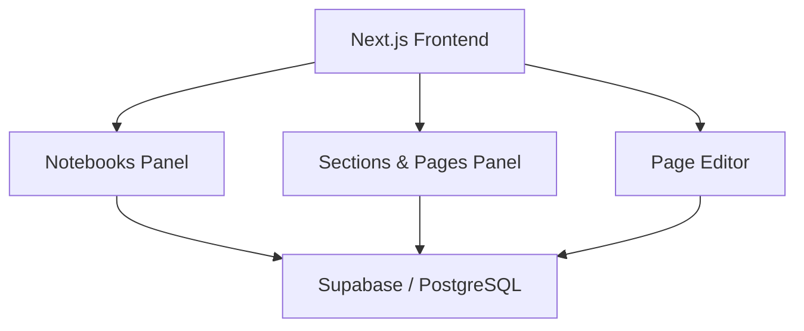

# Spatial Notes (OneNote App)

Spatial Notes is a high-fidelity digital notebook application featuring a hierarchical organization system of notebooks, sections, and pages. Designed for power users who need a structured way to capture ideas and organize information, it provides a seamless editing experience with a focus on spatial organization and rapid navigation.

## 🚀 Key Features

- **Hierarchical Organization:** Structure your notes into Notebooks, Sections, and Pages for maximum clarity.
- **Rich Page Editor:** Intuitive editing interface for capturing and formatting detailed notes.
- **Draggable Navigation:** Sortable notebooks, sections, and pages for a fully customizable workspace.
- **Breadcrumb Navigation:** Effortlessly navigate through your note hierarchy with integrated breadcrumbs.
- **Real-time Sync:** Powered by Supabase for instantaneous data synchronization across devices.

## 🏗️ Technical Architecture



**High-Level Flow:**
```
[ Select Notebook ] ──> [ Load Sections ] ──> [ Select Page ] ──> [ Open Editor ]
          │                         │                        │
          └─────────────────────────┼────────────────────────┘
                                    ▼
                        [ Centralized Notes Store ]
                                    ▼
                        [ Persistent Storage (Supabase) ]
```

## 🛠️ Tech Stack

- **Frontend:** Next.js 15+ (App Router), TypeScript, Tailwind CSS
- **Interactivity:** Dnd-kit for sortable notebooks and sections
- **Backend/Database:** Supabase (Auth, PostgreSQL)
- **State Management:** Custom stores for notes and panel management
- **UI Components:** Shadcn/ui (Radix UI)

## 🏃 How to Run

### Prerequisites
- Node.js 20+
- Supabase account and CLI

### Installation
```bash
# Clone the repository
git clone https://github.com/pavandongare/onenote-app.git
cd onenote-app

# Install dependencies
npm install
```

### Environment Setup
Create a `.env.local` file:
```
NEXT_PUBLIC_SUPABASE_URL=your_url
NEXT_PUBLIC_SUPABASE_ANON_KEY=your_key
```

### Development
```bash
# Run the development server
npm run dev
```

---
Built with ❤️ by [Pavan Dongare](https://github.com/pavandongare)
